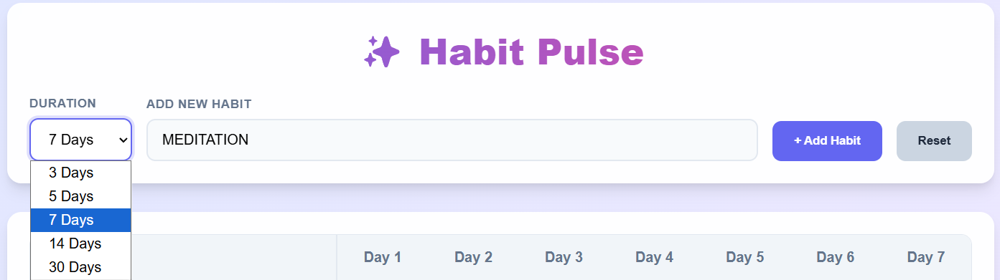
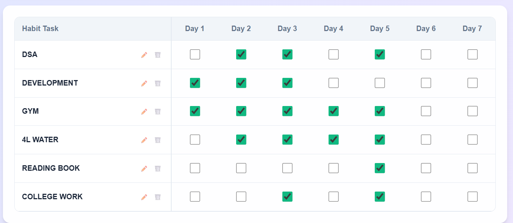
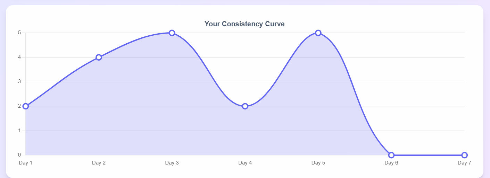

# HabitPulse 🚀

<div align="center">

# 🌟 HabitPulse

### Track Habits. Build Consistency. Stay Productive.

<p align="center">
  A modern and responsive habit tracking web app built with React + Vite.
</p>

<p align="center">


</p>

🔗 **Live Demo:**
👉 [https://shivbhardwaj18.github.io/HABIT-PULSE/](https://shivbhardwaj18.github.io/HABIT-PULSE/)

</div>

---

# 📖 About The Project

**HabitPulse** is a clean and interactive habit tracking web application that helps users maintain consistency in their daily routines.

Users can create habits, mark daily completions, analyze progress visually through real-time charts, and customize tracking durations — all without needing any backend or authentication system.

All habit data is stored directly in the browser using **localStorage**, making the app lightweight, fast, and privacy-friendly.

---

# ✨ Features

✅ Add new habits instantly
✅ Inline edit existing habits
✅ Delete habits easily
✅ Track daily completion using checkboxes
✅ Select custom durations:

* 3 Days
* 5 Days
* 7 Days
* 14 Days
* 30 Days

✅ Real-time progress visualization using Chart.js
✅ Persistent data with localStorage
✅ Reset all habit data option
✅ Fully responsive modern UI
✅ Fast performance with Vite + React 18

---

# 🛠️ Tech Stack

| Technology      | Purpose                            |
| --------------- | ---------------------------------- |
| React 18        | Frontend UI                        |
| Vite            | Fast development & build tool      |
| Chart.js        | Data visualization                 |
| react-chartjs-2 | React wrapper for Chart.js         |
| localStorage    | Client-side data persistence       |
| CSS             | Custom styling & responsive design |

---

# 📂 Project Structure

```bash
HabitPulse/
│
├── src/
│   ├── components/
│   │   ├── HabitForm.jsx
│   │   ├── HabitGrid.jsx
│   │   └── ProgressChart.jsx
│   │
│   ├── App.jsx
│   ├── main.jsx
│   └── styles.css
│
├── public/
├── package.json
└── vite.config.js
```

### Component Overview

| File                | Description                                 |
| ------------------- | ------------------------------------------- |
| `App.jsx`           | Main state management                       |
| `HabitForm.jsx`     | Add habits, duration selector, reset button |
| `HabitGrid.jsx`     | Habit table with checkboxes, edit & delete  |
| `ProgressChart.jsx` | Real-time consistency line chart            |

---

# 🚀 Getting Started

## 1️⃣ Clone the Repository

```bash
git clone https://github.com/shivbhardwaj18/HABIT-PULSE.git
```

---

## 2️⃣ Navigate to Project Folder

```bash
cd HABIT-PULSE
```

---

## 3️⃣ Install Dependencies

```bash
npm install
```

---

## 4️⃣ Run Development Server

```bash
npm run dev
```

---

## 5️⃣ Build for Production

```bash
npm run build
```

---

# 📊 Live Demo

🔗 [https://shivbhardwaj18.github.io/HABIT-PULSE](https://shivbhardwaj18.github.io/HABIT-PULSE)

---

# 📸 Screenshots

> Add your screenshots here

```md



```

---

# 🎯 Key Highlights

* ⚡ Blazing fast with Vite
* 📈 Real-time habit analytics
* 💾 Persistent storage without backend
* 🎨 Clean responsive UI
* 🧠 Productivity-focused experience

---

# 🧩 Future Improvements

* Dark mode support 🌙
* Weekly/monthly analytics 📊
* Export habit data 📁
* PWA support 📱
* User authentication 🔐

---

# 🤝 Contributing

Contributions are welcome!

1. Fork the repository
2. Create a new branch
3. Commit your changes
4. Push the branch
5. Open a Pull Request

---

# 📜 License

This project is licensed under the **MIT License**.

---

<div align="center">

### ⭐ If you like this project, consider giving it a star on GitHub!

🔗 GitHub Repository:
[https://github.com/shivbhardwaj18/HABIT-PULSE](https://github.com/shivbhardwaj18/HABIT-PULSE)

</div>
